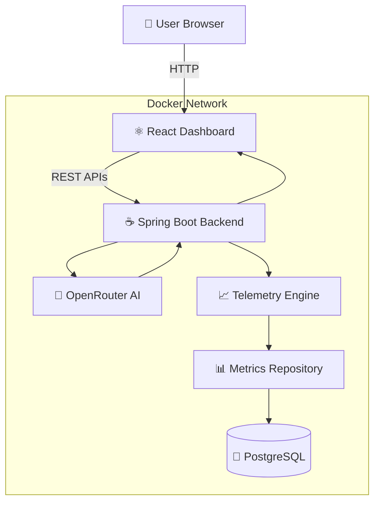
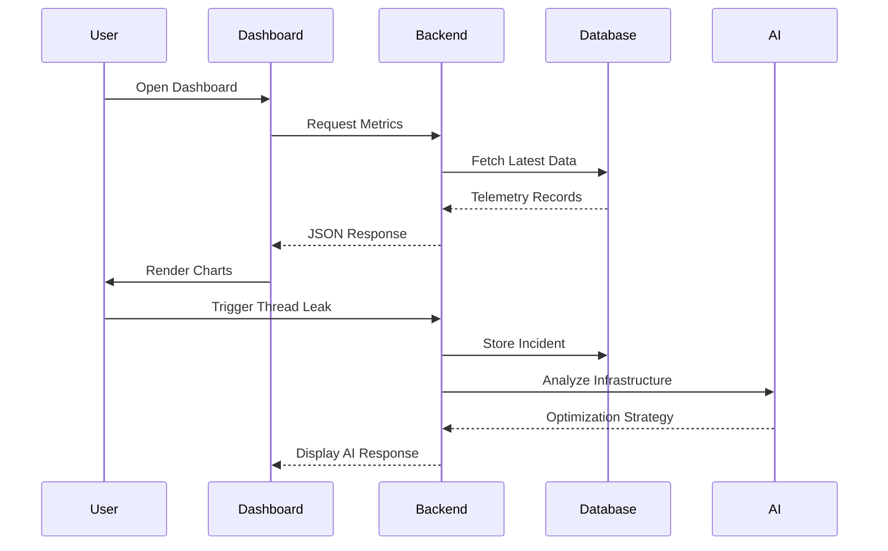
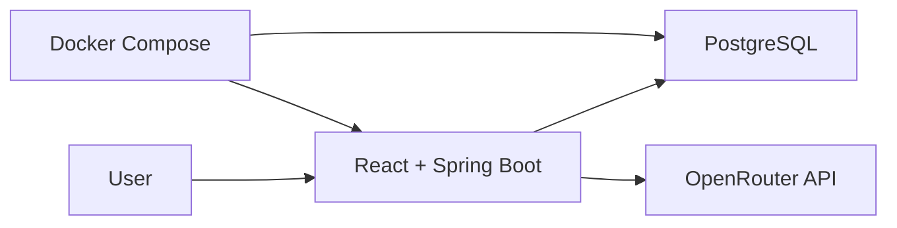

# 📸 Dashboard Preview

## 🖥️ Operations Dashboard

> *Real-time telemetry dashboard displaying CPU usage, memory utilization, infrastructure health indicators, and operational metrics.*

<p align="center">
  
</p>

---

## 📈 Live Telemetry Monitoring

> *Interactive telemetry stream continuously visualizing infrastructure metrics with high-frequency updates.*

<p align="center">
  
</p>

---

## 🚨 Incident Simulation

> *Inject a simulated thread leak and observe live changes across telemetry, throughput, JVM memory, and AI-assisted diagnostics.*

<p align="center">
  
</p>

---

## 🤖 AI Diagnostic Console

> *Integrated AI assistant capable of analyzing infrastructure issues and generating optimization strategies in real time.*

<p align="center">
  
</p>

---

## Live Telemetry Monitoring

> *Interactive telemetry stream continuously visualizing infrastructure metrics with high-frequency updates.*

<p align="center">


</p>

---

## Incident Simulation

> *Simulate infrastructure failures such as thread leaks and observe system behavior in real time.*

<p align="center">


</p>

---

## AI Diagnostic Console

> *Integrated AI assistant capable of analyzing infrastructure issues and generating optimization strategies.*

<p align="center">


</p>

---

# ✨ Key Features

| Feature | Description |
|----------|-------------|
| ⚡ Real-Time Telemetry | Continuous monitoring of CPU, memory, and infrastructure metrics |
| 📊 Interactive Dashboard | Modern React dashboard with responsive charts and analytics |
| 🤖 AI Diagnostics | OpenRouter-powered infrastructure troubleshooting assistant |
| 🚨 Incident Simulation | Simulate thread leaks and production-like infrastructure failures |
| 📈 Live Charts | High-frequency telemetry visualization with smooth updates |
| 🧠 Predictive Analytics | AI-generated recommendations based on system behavior |
| 🔒 Secure Configuration | Environment variable-based secrets management |
| 🐳 Dockerized Deployment | One-command multi-container deployment |
| ☁ AWS Ready | Optimized for cloud deployment on AWS EC2 |
| 🌙 Modern UI | Cyberpunk-inspired responsive dark interface |

---

# 🎯 Why VortexOps?

Modern infrastructure teams often rely on multiple disconnected tools for monitoring, diagnostics, and incident response.

VortexOps demonstrates how these workflows can be unified into a single intelligent platform.

Instead of merely displaying telemetry, the system actively assists engineers by:

- Detecting anomalies
- Simulating infrastructure failures
- Visualizing performance trends
- Providing AI-powered optimization suggestions
- Reducing troubleshooting time
- Delivering actionable diagnostics

The result is a streamlined observability experience that closely resembles enterprise-grade monitoring solutions.

---

# 🏗 High-Level Architecture

```text
                    ┌───────────────────────┐
                    │     Web Browser       │
                    └──────────┬────────────┘
                               │
                               │ HTTP / REST
                               │
                    ┌──────────▼────────────┐
                    │    React Dashboard    │
                    └──────────┬────────────┘
                               │
                    REST APIs / WebSocket
                               │
                               ▼
                   Spring Boot Backend
                               │
               ┌───────────────┼───────────────┐
               │               │               │
               ▼               ▼               ▼
        PostgreSQL        OpenRouter AI     Metrics Engine

```

---

# 💡 Core Capabilities

### 📊 Infrastructure Monitoring

Monitor CPU utilization, memory consumption, system throughput, and application performance through an intuitive operations dashboard.

---

### 🤖 AI-Powered Diagnostics

Analyze infrastructure anomalies using OpenRouter AI and receive contextual troubleshooting guidance, optimization commands, and deployment recommendations.

---

### 🚨 Incident Simulation

Safely simulate production issues such as thread leaks and monitor system behavior to evaluate infrastructure resilience.

---

### 📈 Predictive Analytics

Transform raw telemetry into meaningful insights by correlating system metrics with AI-generated analysis and recommendations.

---

### 🐳 Cloud-Native Deployment

Deploy the complete platform using Docker Compose with PostgreSQL, Spring Boot, and React working together as a unified application.

---

> **Next:** In **Part 2**, we'll cover:
> - Detailed architecture diagrams
> - Complete technology stack
> - Project structure
> - Backend architecture
> - Frontend architecture


# 🏗️ System Architecture

VortexOps follows a unified full-stack architecture where the React frontend is bundled directly into the Spring Boot application. This approach eliminates cross-origin issues, simplifies deployment, and enables the entire platform to run behind a single HTTP endpoint.

Unlike traditional microservice-based dashboards that require multiple exposed ports, VortexOps packages the frontend and backend into one deployable artifact while PostgreSQL operates as an isolated database service within the Docker network.



---

# 🔄 Data Flow

The telemetry processing pipeline has been designed to minimize latency while maintaining scalability.



---

# 🏛 Backend Architecture

The backend is developed using **Java 21** and **Spring Boot 3.x**, following a layered architecture that separates responsibilities into controllers, services, repositories, and configuration modules.

```
Controller Layer
        │
        ▼
Business Service Layer
        │
        ▼
Repository Layer (Spring Data JPA)
        │
        ▼
PostgreSQL Database
```

### Responsibilities

### 🎯 Controller Layer

- REST API Endpoints
- Request Validation
- Response Serialization
- HTTP Status Management

---

### ⚙ Service Layer

Contains all business logic including:

- Telemetry aggregation
- Incident simulation
- AI request processing
- Metric calculations
- Data transformation

---

### 💾 Repository Layer

Responsible for

- CRUD Operations
- Database Queries
- Spring Data JPA Integration
- Hibernate ORM
- Transaction Management

---

### ⚡ Performance Optimizations

- HikariCP Connection Pooling
- Lazy Entity Loading
- Indexed PostgreSQL Queries
- Dependency Injection
- Optimized API Responses

---

# 🎨 Frontend Architecture

The frontend has been developed using **React 18** and **Vite**, enabling lightning-fast rendering and hot module replacement during development.

The dashboard has been designed around reusable functional components to maximize maintainability and scalability.

```
App

├── Navbar

├── Dashboard

│      ├── Metric Cards

│      ├── Live Charts

│      ├── Incident Panel

│      └── AI Diagnostics

├── Components

└── Utilities
```

### Frontend Features

- Functional Components

- React Hooks

- Responsive Layout

- Dark Theme

- Live State Updates

- Modular Components

- Reusable UI Elements

- Optimized Rendering

---

# 📊 Technology Stack

| Layer | Technology |
|--------|------------|
| Language | Java 21 |
| Backend Framework | Spring Boot 3.x |
| Frontend | React 18 |
| Build Tool | Vite |
| Styling | Tailwind CSS |
| Charts | Recharts |
| ORM | Hibernate |
| Data Access | Spring Data JPA |
| Database | PostgreSQL 15 |
| Connection Pool | HikariCP |
| AI Integration | OpenRouter API |
| Build Tool | Maven |
| Containerization | Docker |
| Orchestration | Docker Compose |
| Cloud | AWS EC2 |

---

# 📂 Project Structure

```
VortexOps
│
├── backend
│   ├── controller
│   ├── service
│   ├── repository
│   ├── entity
│   ├── dto
│   ├── config
│   ├── exception
│   └── resources
│
├── frontend
│   ├── src
│   │
│   ├── components
│   ├── pages
│   ├── hooks
│   ├── services
│   ├── assets
│   └── styles
│
├── docker
│
├── screenshots
│
├── Dockerfile
│
├── docker-compose.yml
│
├── pom.xml
│
└── README.md
```

---

# 🗄 Database Design

PostgreSQL serves as the persistent storage layer for telemetry records, diagnostic logs, simulated incidents, and historical system metrics.

### Primary Responsibilities

- Telemetry Storage
- Historical Metrics
- Incident Logs
- Configuration Records
- AI Diagnostic History

---

# 🐳 Docker Deployment Architecture

VortexOps is fully containerized using Docker Compose.



The application startup sequence is orchestrated to ensure database readiness before the backend initializes. Health checks prevent the application from attempting database connections before PostgreSQL becomes available.

---

# 🚀 Engineering Principles

The platform was designed around several core engineering principles:

## ⚡ Performance First

- Optimized REST APIs
- Lightweight React Components
- Efficient Database Queries
- Connection Pooling

---

## 🔒 Security

- Environment Variable Configuration
- Database Credential Isolation
- Containerized Deployment
- Secret Key Protection

---

## 📈 Scalability

- Modular Architecture
- Decoupled Components
- Reusable Services
- Stateless Backend

---

## 🧩 Maintainability

- Clean Code Practices
- Layered Architecture
- Dependency Injection
- Separation of Concerns

---

# 🌟 Why This Architecture?

VortexOps intentionally combines a modern React frontend with a robust Spring Boot backend to demonstrate how enterprise-grade monitoring platforms are built.

The architecture balances simplicity with scalability by:

- Delivering the frontend directly through Spring Boot
- Using PostgreSQL for reliable persistence
- Leveraging Docker for reproducible deployments
- Integrating AI to accelerate diagnostics
- Keeping all components modular for future expansion

This design enables the project to serve as both a practical monitoring platform and a showcase of modern full-stack software engineering principles.

---

➡️ **Next:** **Part 3** will include:

- 🚀 Installation Guide
- 🐳 Docker Setup
- ⚙️ Environment Variables
- ☁️ AWS EC2 Deployment
- 📡 REST API Documentation
- 🤖 OpenRouter AI Integration
- 🔧 Configuration Guide
- 🧪 Running Locally
- 📋 Troubleshooting
> - Database design
> - Docker orchestration
> - Data flow explanation

# 🚀 Getting Started

Follow the steps below to set up VortexOps locally or deploy it to your own cloud infrastructure.

---

# 📋 Prerequisites

Ensure the following software is installed on your machine before proceeding.

| Software | Version |
|----------|---------|
| Java | 21 or later |
| Maven | 3.9+ |
| Node.js | 18+ |
| npm | Latest |
| PostgreSQL | 15+ |
| Docker | 20.10+ |
| Docker Compose | 2.0+ |
| Git | Latest |

---

# 📥 Clone Repository

```bash
git clone https://github.com/YOUR_USERNAME/VortexOps.git

cd VortexOps
```

---

# ⚙️ Environment Configuration

Create an environment file or configure your environment variables before starting the application.

Example:

```env
# PostgreSQL

DB_HOST=postgres-db
DB_PORT=5432
DB_NAME=vortexops_metrics_db
DB_USERNAME=postgres
DB_PASSWORD=your_secure_password

# AI

OPENROUTER_API_KEY=your_openrouter_api_key

# Spring

SPRING_PROFILES_ACTIVE=prod

SERVER_PORT=8080
```

Never commit API keys or passwords to version control.

---

# 🗄 Configure PostgreSQL

Create a PostgreSQL database.

```sql
CREATE DATABASE vortexops_metrics_db;
```

Update the application configuration if using a different database name.

---

# 🏗 Build Backend

Compile the Spring Boot application.

```bash
cd backend

mvn clean install
```

Run the backend.

```bash
mvn spring-boot:run
```

The backend will start on

```
http://localhost:8080
```

---

# ⚛ Run Frontend

Move into the frontend directory.

```bash
cd frontend
```

Install dependencies.

```bash
npm install
```

Start development server.

```bash
npm run dev
```

Default frontend

```
http://localhost:5173
```

---

# 🐳 Docker Deployment

VortexOps has been designed for containerized deployment.

Simply execute

```bash
docker compose up --build
```

Or in detached mode

```bash
docker compose up -d --build
```

Docker will automatically

- Build the frontend
- Compile the backend
- Create PostgreSQL container
- Initialize the database
- Connect services together
- Start the application

---

# 📦 Docker Services

| Service | Description |
|----------|-------------|
| Frontend | React Dashboard |
| Backend | Spring Boot API |
| Database | PostgreSQL |
| AI | OpenRouter Integration |

---

# 🏥 Container Health Checks

Docker Compose waits until PostgreSQL becomes healthy before starting Spring Boot.

This prevents startup failures caused by unavailable database connections.

---

# ☁ AWS EC2 Deployment

The project is optimized for deployment on Amazon EC2.

Deployment steps

1. Launch an EC2 Ubuntu instance.

2. Install Docker.

```bash
sudo apt update

sudo apt install docker.io
```

3. Install Docker Compose.

4. Clone repository.

```bash
git clone https://github.com/YOUR_USERNAME/VortexOps.git
```

5. Navigate into project.

```bash
cd VortexOps
```

6. Configure environment variables.

7. Build containers.

```bash
docker compose up -d --build
```

8. Open EC2 Security Group

Allow

```
8080
```

Your application becomes accessible at

```
http://YOUR_PUBLIC_IP:8080
```

---

# 🌐 Live Deployment

Current production deployment

```
http://13.51.156.99:8080
```

Hosted using

- AWS EC2
- Docker Compose
- PostgreSQL
- Spring Boot
- React

---

# 📡 REST API Overview

The backend exposes RESTful endpoints used by the React dashboard.

## System

```
GET /api/system
```

Returns application status.

---

## Metrics

```
GET /api/metrics
```

Returns current telemetry.

---

## Historical Metrics

```
GET /api/history
```

Returns historical telemetry.

---

## AI Diagnostics

```
POST /api/diagnose
```

Generates AI recommendations based on telemetry.

---

## Incident Simulation

```
POST /api/simulate
```

Creates simulated production incidents.

---

## Health

```
GET /actuator/health
```

Spring Boot health endpoint.

---

# 🤖 AI Diagnostic Engine

One of the core features of VortexOps is the AI-powered diagnostics engine.

Instead of manually interpreting telemetry, users can submit infrastructure data to the integrated OpenRouter API.

The AI analyzes

- CPU spikes
- Memory pressure
- Thread leaks
- Infrastructure anomalies
- Resource utilization
- Performance bottlenecks

It then produces

- Root cause analysis
- Performance recommendations
- Infrastructure optimization advice
- Troubleshooting guidance
- Preventive maintenance suggestions

This enables engineers to investigate incidents more efficiently while reducing manual analysis.

---

# 🔐 Security

Security considerations include

- Environment variable configuration
- Secure database credentials
- Docker network isolation
- API key protection
- Backend validation
- Spring Security ready architecture

---

# ⚡ Performance Optimizations

Several optimizations have been incorporated to ensure smooth operation.

✔ HikariCP Connection Pooling

✔ Indexed PostgreSQL Queries

✔ Efficient REST APIs

✔ Modular React Components

✔ Lightweight Docker Images

✔ Fast Vite Bundling

✔ Optimized Database Access

✔ Lazy Loading

---

# 🧪 Running Tests

Backend

```bash
mvn test
```

Frontend

```bash
npm test
```

---

# 🔧 Troubleshooting

## Docker fails to connect

Ensure Docker Desktop or Docker Engine is running.

---

## Database connection error

Verify

- PostgreSQL is running
- Database credentials are correct
- Environment variables are configured

---

## OpenRouter not responding

Check

- API Key
- Internet connection
- OpenRouter availability

---

## React not loading

Run

```bash
npm install

npm run dev
```

---

# 📈 Performance Summary

The platform has been engineered to provide

- Fast startup times

- Low memory footprint

- Responsive dashboard rendering

- Efficient database interactions

- AI-assisted infrastructure diagnostics

- Reliable Docker deployment

These characteristics make VortexOps suitable as both a learning project and a demonstration of modern enterprise application architecture.

---

➡️ **Next:** **Part 4** will complete the README with:

- 🛣️ Future Roadmap
- 🤝 Contributing Guide
- 📜 License
- 👨‍💻 Author Section
- 🙏 Acknowledgements
- ⭐ Support the Project
- 💼 Recruiter-Friendly Highlights
- 🎯 Final Footer

---

# 🛣️ Roadmap

VortexOps is actively evolving. The following features are planned for future releases.

## Current Features

- [x] Real-Time Telemetry Dashboard
- [x] Spring Boot REST APIs
- [x] PostgreSQL Integration
- [x] Docker Compose Deployment
- [x] AI-Powered Diagnostics
- [x] Interactive Charts
- [x] Incident Simulation
- [x] AWS EC2 Deployment
- [x] Responsive React UI

---

## Upcoming Features

- [ ] WebSocket-based Live Streaming
- [ ] Prometheus Metrics Exporter
- [ ] Grafana Dashboard Integration
- [ ] Kubernetes Deployment
- [ ] Authentication & Authorization
- [ ] Multi-User Dashboard
- [ ] Notification & Alert System
- [ ] Email Alerts
- [ ] Slack & Discord Integration
- [ ] Redis Caching
- [ ] RabbitMQ Event Processing
- [ ] Microservices Architecture
- [ ] Log Aggregation
- [ ] Dark/Light Theme Switching
- [ ] Mobile Responsive Dashboard Enhancements

---

# 💼 Real-World Use Cases

VortexOps can be adapted for a variety of enterprise monitoring scenarios.

### 🖥️ Infrastructure Monitoring

Monitor server health, CPU utilization, memory consumption, and application performance across distributed environments.

---

### ☁️ Cloud Operations

Observe cloud-hosted workloads, monitor resource utilization, and identify infrastructure bottlenecks.

---

### 📊 DevOps & SRE

Support DevOps teams with centralized telemetry, incident simulation, and AI-assisted troubleshooting.

---

### 🤖 AI-Assisted Operations

Leverage artificial intelligence to analyze infrastructure behavior, detect anomalies, and generate actionable recommendations.

---

### 🎓 Educational Platform

A practical demonstration of how modern observability platforms combine monitoring, backend engineering, cloud deployment, and AI into a unified solution.

---

# 🤝 Contributing

Contributions are welcome and appreciated.

If you'd like to improve VortexOps, follow these steps:

1. Fork the repository.

2. Create a feature branch.

```bash
git checkout -b feature/amazing-feature
```

3. Commit your changes.

```bash
git commit -m "Add amazing feature"
```

4. Push to your branch.

```bash
git push origin feature/amazing-feature
```

5. Open a Pull Request.

Please ensure that your code follows the existing project structure and coding standards.

---

# 🧪 Coding Standards

The project follows several engineering best practices.

- Clean Architecture
- SOLID Principles
- Layered Design
- RESTful APIs
- Dependency Injection
- Modular React Components
- Environment-Based Configuration
- Meaningful Commit Messages

---

# 📜 License

This project is licensed under the **MIT License**.

You are free to use, modify, and distribute this project in accordance with the terms of the license.

See the `LICENSE` file for additional details.

---

# 🙏 Acknowledgements

Special thanks to the technologies and communities that made this project possible.

- Java
- Spring Boot
- React
- Vite
- PostgreSQL
- Docker
- OpenRouter AI
- Maven
- Tailwind CSS
- Recharts
- AWS

---

# 📈 Learning Outcomes

This project demonstrates practical experience with:

- Full Stack Development
- REST API Design
- Java Enterprise Development
- Spring Boot
- React Development
- PostgreSQL Database Design
- Docker Containerization
- Cloud Deployment
- AI Integration
- Modern Software Architecture
- Infrastructure Monitoring
- DevOps Fundamentals

---

# 🌍 Browser Support

| Browser | Supported |
|----------|-----------|
| Chrome | ✅ |
| Edge | ✅ |
| Firefox | ✅ |
| Brave | ✅ |
| Safari | ✅ |

---

# ⭐ Repository Statistics

If you found this project helpful:

⭐ Star the repository

🍴 Fork the repository

🐛 Report issues

💡 Suggest improvements

🤝 Contribute new features

Your support helps improve the project and encourages further development.

---

# 👨‍💻 About the Developer

<div align="center">

## Priyam Shrivastava

**Full Stack Java Developer | AI Enthusiast | Cloud & DevOps Learner**

Passionate about building scalable, cloud-native applications with modern technologies including Java, Spring Boot, React, Docker, PostgreSQL, and Artificial Intelligence.

Always exploring innovative ways to combine backend engineering, intelligent automation, and user-centric design to solve real-world problems.

</div>

---

# 📫 Connect With Me

<p align="center">

<a href="https://github.com/YOUR_USERNAME">

</a>

<a href="https://linkedin.com/in/YOUR_LINKEDIN">

</a>

<a href="mailto:YOUR_EMAIL">

</a>

<a href="https://YOUR_PORTFOLIO">

</a>

</p>

---

# ❤️ Support

If you enjoyed this project, please consider giving it a ⭐ on GitHub.

It motivates me to continue building high-quality open-source software and sharing new projects with the community.

---

<div align="center">

# 🌀 VORTEXOPS

### Intelligent Telemetry • Predictive Analytics • Modern Infrastructure Monitoring

---

*"Transforming raw telemetry into actionable intelligence through the power of AI."*

---

Built with ❤️ using

**Java • Spring Boot • React • PostgreSQL • Docker • OpenRouter AI**

© 2026 Priyam Shrivastava. All Rights Reserved.

</div>
